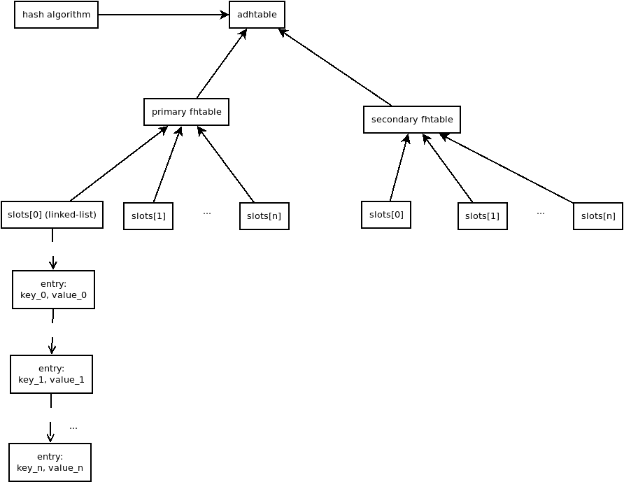
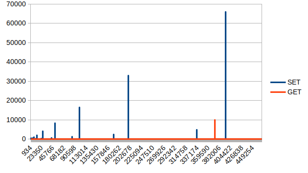
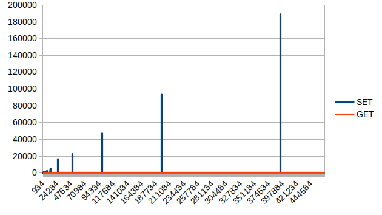
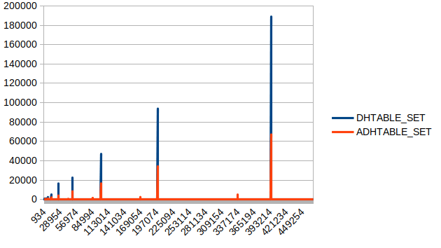
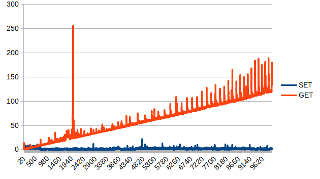
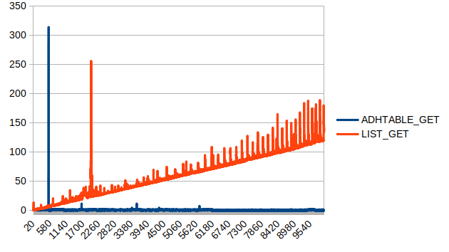

# KDB
A hashtable that seamlessly expands itself without blocking thanks to "incremental rehash" algorithm.

This is the same logic that Redis applies for its internal backbone data structure.

## Build
	make
	./benchmark <data_structure> <data_file>
Supported data structures are `adhtable`, `dhtable` and `list`. This benchmark program will output the operation measurements to `report_set.txt` and `report_get.txt`.

## Test
	cd tests/
	./test.sh
`valgrind` is required for memory leak checking.

## Architecture

## Test data
A text file contains over 466K English words, with numbers and symbols. 
[words.txt](https://github.com/dwyl/english-txt/words/blob/master.words) 

## Benchmark
The measurement unit is CPU clock, in my case `CLOCKS_PER_SEC == 1000000`, which means 1 CPU clock is equivalent with 1 microsecond.

### Advanced Dynamic Hash Table (adhtable - with incremental migration)

Most of the time, the complexity seems to be `O(1)`, except few spikes that happens occasionally when the table expands itself. Thus, this is called *constant armotized time* complexity.
The above table used `djb2` hash algorithm. I tried `sdbm` and the result is not that much different
 

Here is the detailed figures, `djb2` seems to be a little bit better than `sdbm`

| avg_set_djb2     | avg_set_sdbm     | avg_get_djb2     | avg_get_sdbm     |
|------------------|------------------|------------------|------------------|
| 1.57724450274461 | 1.58685331292828 | 1.18986563098139 | 1.20032536635866 |

### Dynamic Hash Table (dhtable - without incremental migration)
 

The pattern of expansion is pretty much the same. `GET` is very consistent, but `SET`'s performance is signficantly degraded. Let's compare each of them.

`adhtable` is 3 times faster than `dhtable`.

### Linked-list as a "lookup table" (duh)
This is to see how stupid it is to use the wrong data structure for the job.

`SET` operation is surely `O(1)`, but `GET` is painfully slow with `O(n)`. Now, we compare it with the glorious `adhtable`
 

Compared to linked-list, `adhtable` seems to be almost linear. 

## Other reading
* [Under the hood of Redis](http://redisplanet.com/redis/under-the-hood-of-redis-hash-part-1/)
* [Hash functions](http://www.cse.yorku.ca/~oz/hash.html)

## To-do
* [ ] Explain about hash table, load factor, rehash, incremental migration...
* [ ] Explain and improve the architecture diagram
* [ ] Explain the project structure